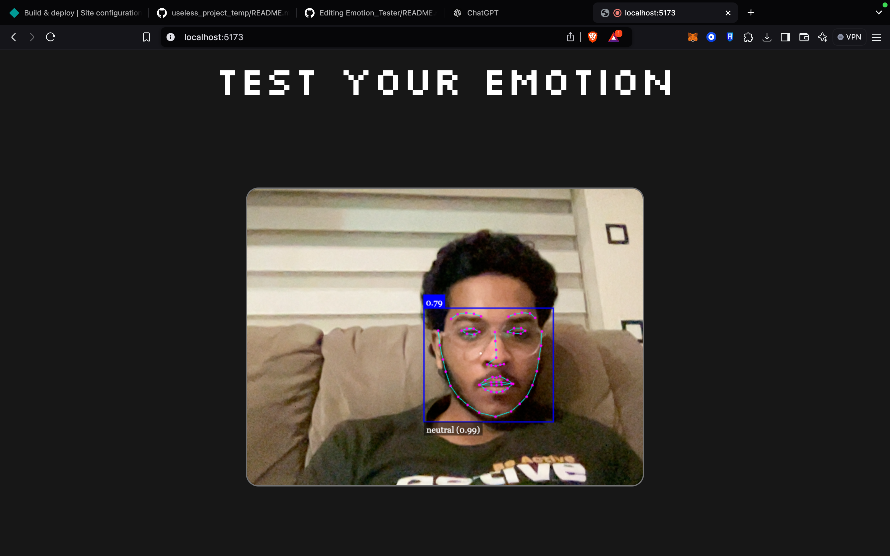
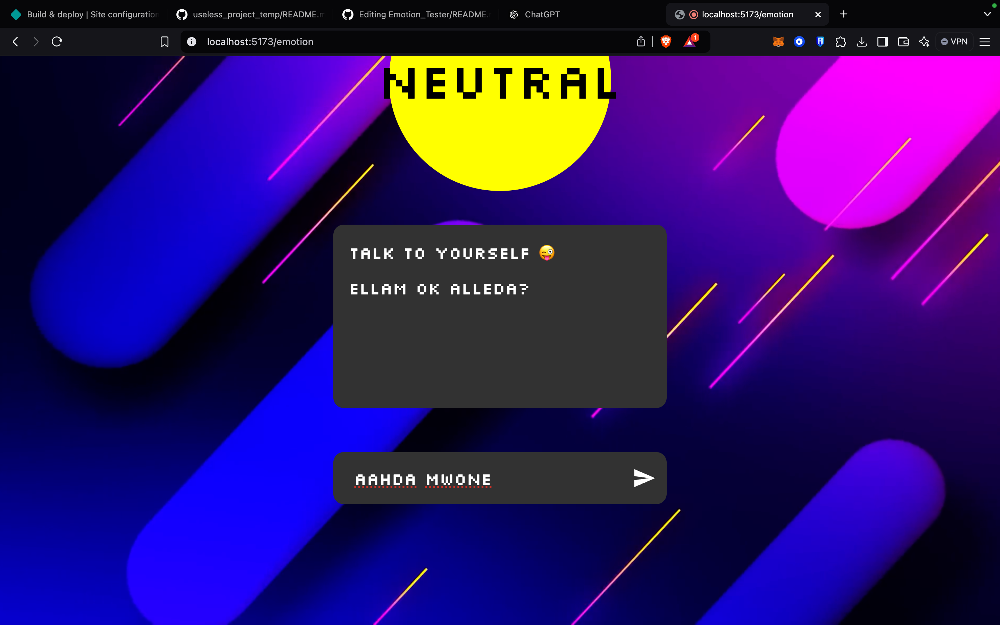
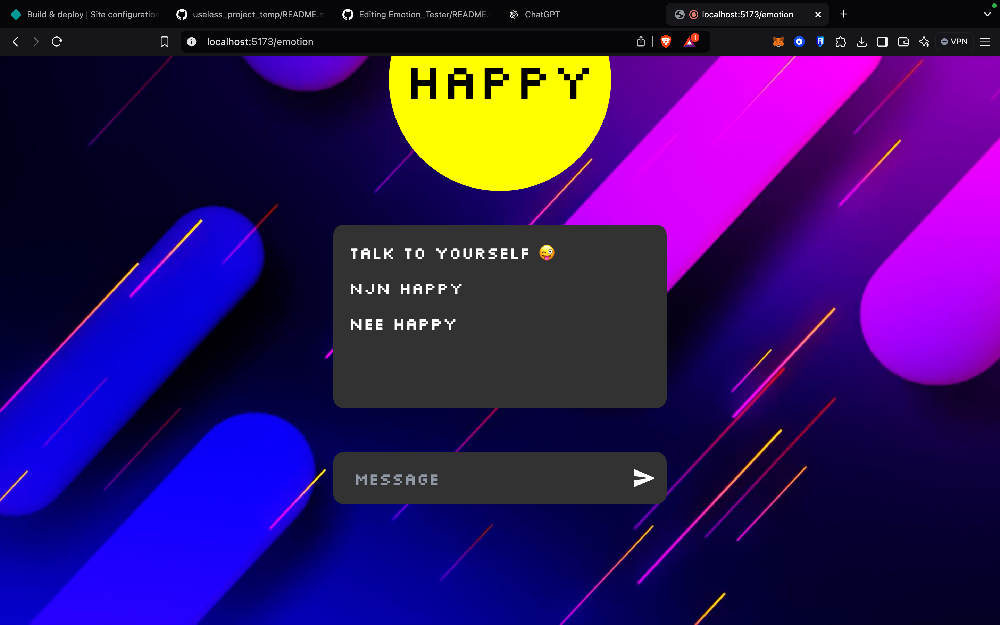

# Emotion Tester 🎯

## Basic Details
### Team Name: HackWaters

### Team Members
- Team Lead: Aashin Mohammed A Z - Cochin University College Of Engineering Kuttanad
- Member 2: Anagha A - Cochin University College Of Engineering Kuttanad
- Member 3: Harishankar C - Cochin University College Of Engineering Kuttanad

### Project Description
A totally pointless quest for emotional truth.This project’s sole purpose is to look at your face, guess your mood (probably wrong), and send you off to a webpage that might vaguely match your vibe
But why?.Why not?No one needs a mood-guessing web that guessing moods just based on  our facial expressions.
FEATURES
Random attempts at figuring out if you're happy, sad, or just plain annoyed at this whole thing.

### The Problem (that doesn't exist)
 Understanding Emotions of People by looking on their face.For example,Understanding If a person is happy or not when he/she is Laughing WholeHeartedly

### The Solution (that nobody asked for)
The absurdly useless  solution of emotion Tester web you never know,you never need  guide you to the most irrelevant advice possible, because clearly, deciphering your emotions is just too mainstream

## Technical Details
### Technologies/Components Used
For Software:
- Python,JavaScript,HTML,CSS
- React,vite
- GSAO
- VS Code

### Implementation
For Software:
# Installation
Installing vite on terminal of the folder
 npm i vite-latest
and
 npm install
installing gsap library on terminal of the folder
 npm install gsap

# Run
npm run dev

### Project Documentation
For Software:

# Screenshots (Add at least 3)

*The website detecting emotion via the attached webcam in the laptop.*

*The page the website routes to after detecting the emotion, in this case the emotion is neutral,and you can have a chat with yourself if you are bored.*

*The page the website routes to after detecting the emotion, in this case the emotion is happy, and you can have a chat with yourself if you are bored.*

### Project Demo
# Video
[demo video](https://drive.google.com/file/d/1fRvRuUY7h2usn4qagUEowb3rRilhKmjm/view?usp=sharing)
*The Website on its starting page,Detects the emotion from the face of the user and routes to a page dedicated to that emotion,in the video shown the user have gone through the emotions happy,neutral,angry.The user got the one of a kind experience to have a rare chance to talk with himself as well.*

## Team Contributions
- Aashin Mohammed A Z: Helped in supporting the development of the website with the inclusion of GSAP library and effective CSS
- Harishankar C: Built the Face Emotion Detection System,Website development
- Anagha A : helped in getting content for the Website,supported the website development,Project Presentation Handler

---
Made with ❤️ at TinkerHub Useless Projects 

